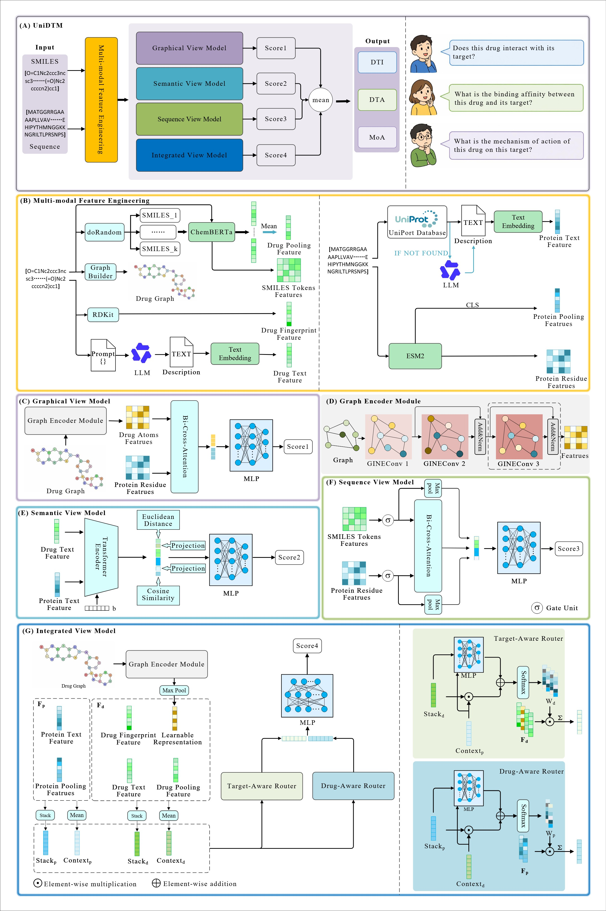

# UniDTM: A Unified Multi-View Learning Framework for Drug-Target Interaction, Binding Affinity, and Mechanism of Action Prediction

## Introduction

UniDTM is a multi-modal ensemble framework for drug–target related tasks, supporting DTA (affinity regression), DTI (interaction classification), and MoA (mechanism-of-action classification).



## Preparation

Clone this repository or download the code as a ZIP archive.

UniDTM is developed and tested on Linux with GPU. Suggested environment:

- python=3.10
- cuda=12.1
- torch>=2.0
- torch-geometric>=2.3
- transformers>=4.30
- rdkit>=2022.9.5
- fair-esm>=2.0
- scikit-learn>=1.2
- scipy>=1.10
- lifelines>=0.27
- pandas>=1.5
- numpy>=1.23
- tqdm>=4.65
- openai>=1.0
- requests>=2.28

Create a conda environment and install dependencies:

```bash
conda create -n unidtm python=3.10 -y
conda activate unidtm

# Install PyTorch matching your CUDA version (example: CUDA 12.1)
pip install torch torchvision torchaudio --index-url https://download.pytorch.org/whl/cu121

pip install -r requirements.txt

# Install PyG extensions for your torch/CUDA version
# See: https://pytorch-geometric.readthedocs.io/en/latest/install/installation.html
pip install torch-scatter torch-sparse torch-cluster torch-spline-conv \
  -f https://data.pyg.org/whl/torch-2.1.0+cu121.html
```

Pretrained models used for feature extraction:

- [ESM-2](https://github.com/facebookresearch/esm) 
- [ChemBERTa](https://huggingface.co/DeepChem) 

> If HuggingFace downloads are slow, you may set `export HF_ENDPOINT=https://hf-mirror.com`.

## Usage

Run all commands from the project root unless noted otherwise.

### 1. Data

CSV splits are provided under `data/`:

- DTA / DTI: `davis`, `kiba`
- MoA: `activation`, `inhibition`
- Splits: `cold_drug`, `cold_target`, `cold_drug_target`

Each split has `train.csv` / `test.csv` with columns such as `Drug`, `Target`, `Y`.

Before training, prepare PyG graphs and modality embeddings (see below). Training expects:

| Task | Graph data | Feature dicts |
|------|------------|---------------|
| DTA | `data/dta/{dataset}/{split}/processed/` | `data/dta/{dataset}/*.pt` |
| DTI | `data/dti/{dataset}/{split}/processed/` | `data/dti/{dataset}/*.pt` |
| MoA | `data/moa/{dataset}/{split}/processed/` | `data/moa/{dataset}/*.pt` |

### 2. Feature engineering

All feature scripts take `--task {dta,dti,moa}` (required) and optional `--dataset`.
If `--dataset` is omitted, all datasets of that task are processed.

Most scripts read `data/{task}/{dataset}/cold_drug/{train,test}.csv` and write shared features to `data/{task}/{dataset}/`.
`get_drug_graph_esm2_redidue.py` additionally builds `processed/{train,test}.pt` for **all three** splits.

```bash
# From project root
cd scripts/multi_modal_feature_engineering

# Example: DTA / davis
python get_drug_graph_esm2_redidue.py --task dta --dataset davis
python get_esm2_pooling_features.py --task dta --dataset davis
python get_chemberta_pooling_features.py --task dta --dataset davis
python get_chemberta_tokens_features.py --task dta --dataset davis
python get_drug_fingerprint_features.py --task dta --dataset davis
python get_text.py --task dta --dataset davis
python get_text_features.py --task dta --dataset davis

# Process all datasets of a task (omit --dataset)
python get_chemberta_pooling_features.py --task dti
```

Typical outputs under `data/{task}/{dataset}/`:

- `{task}_chemberta_pooling_embs.pt`
- `{task}_chemberta_token_embs.pt`
- `{task}_fingerprint_embs.pt`
- `{task}_protein_features_pooling.pt`
- `{task}_protein_features_pad.pt`
- `drug_text_embeddings.pt`
- `prot_text_embeddings.pt` (MoA: `prot_text_embeddings_qwen.pt`)
- `{split}/processed/train.pt`, `{split}/processed/test.pt`

Edit machine-specific settings in these scripts (ChemBERTa path, GPU id, API key) before running.

### 3. Train / test

Dataset, split, fold, and GPU are configured inside each script (`CUDA_VISIBLE_DEVICES`, `datasets`, `opt`, fold loop). Edit them first, then:

```bash
# From project root
python scripts/dta_train.py
python scripts/dti_train.py
python scripts/moa_train.py
```

Default settings (editable in scripts):

| Script | Outputs |
|--------|---------|
| `dta_train.py` | `saved_model/dta/...`, `saved_result/dta/.../predictions.csv` |
| `dti_train.py` | `saved_model/dti/...`, `saved_result/dti/.../predictions.csv` |
| `moa_train.py` | `saved_model/moa/...`, `saved_result/moa/.../predictions.csv` |

Each script trains the ensemble, evaluates on the test set, and writes `predictions.csv`.

To evaluate a saved checkpoint only, uncomment the `load_state_dict(...)` line in the corresponding train script, comment out `fit(...)`, and run the same command.

## License

This project is licensed under the terms of the MIT license. See [LICENSE](https://github.com/ljquanlab/UniDTM/blob/main/LICENSE) for additional details.
